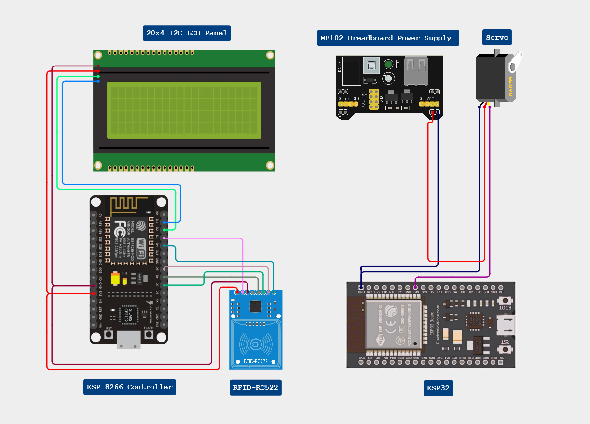
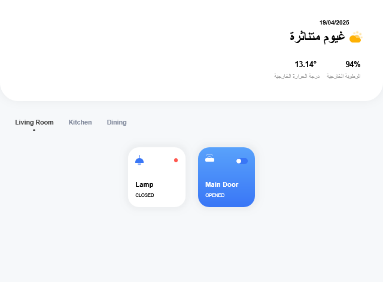

# 🔐 IoT Smart Door System

This project is a smart door access control system using two independent ESP-based modules. It combines RFID authentication, servo motor control, a cloud-based API, and a web interface to provide flexible, remote, and secure door access.

---

## 📦 Features

- 🚪 Servo-controlled door locking/unlocking  
- 📶 Works across **different Wi-Fi networks**  
- 🆔 RFID-based authentication with RC522  
- 📺 I2C LCD screen feedback  
- 🌐 Cloud-connected via HTTP requests  
- 💻 Web interface for manual control  

---

## 🧠 How It Works

### 🟩 System 1: RFID Authentication (Client Side)

- Reads an RFID card using the **RC522** module.
- Shows status on an **I2C LCD** screen (e.g., "Access Granted").
- If the card UID matches the predefined key, it sends an HTTP request to the cloud API to update the door state.
- ✅ **Can be connected to any Wi-Fi network** with internet access.

### 🟦 System 2: Door Controller (Servo Side)

- Continuously fetches the door state from the cloud API.
- If access is granted, it opens the door using a **servo motor**.
- If not, the servo remains in the locked position.
- ✅ **Also works over any Wi-Fi network**, independently from System 1.

### 🌍 Web UI

- A simple web interface allows manual **door opening/closing** via buttons.
- Sends a request to the same cloud API, just like System 1.
- Useful for admins to unlock the door remotely.

---

## 🪛 Wiring Diagrams
Here's is the wiring of the systems

  

---

## 🖼️ Web UI Screenshot

Here’s how the control panel looks:

  

---

## 🔧 Hardware Used

### System 1
- ESP32 or ESP8266
- RC522 RFID reader
- I2C LCD (16x2 or 20x4)
- Jumper wires, breadboard, 3.3V logic level (or converter)

### System 2
- ESP32 or ESP8266
- Servo motor (SG90 recommended)
- External 5V power supply (recommended)
- Jumper wires, breadboard

---

## ☁️ Cloud API

Example endpoints:
- `GET http://your-server/door/doorState/get` – Check if door should be open.
- `GET http://your-server/door/doorState/set?val=true` – Set door state to open.
- `GET http://your-server/door/doorState/set?val=false` – Set door state to closed.

You can host this API on any backend like Flask, Node.js, or Firebase.

---

## 🖥️ Web UI (Optional)

- UI has buttons like **Open** / **Close**.
- Sends `GET` requests to the same endpoints.
- Can be hosted on GitHub Pages, Firebase Hosting, or your own server.

---

## 🛠️ Future Ideas

- Add facial recognition or keypad input
- Use MQTT for real-time performance
- Log entry times for each user
- Add a database for storing allowed card UIDs

---

## 👨‍💻 Author

Made with ❤️ by Walid  
Feel free to contribute, suggest improvements, or fork this project!
